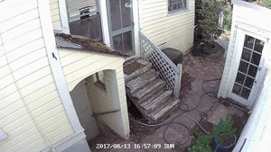

# Security Cam Processor

## Overview

SecurityCamProcessor is a pluggable architecture for performing post-processing on security cam videos. Each plugin defines an output format (such as json or gif). You point the processor at a folder, and it will recursively crawl through it for video files. For every file it finds, it checks whether any plugins need to run, and if so, will act upon them. At the moment, two plugins exist:

- Slice it down to a high-speed animated gif, for easy skimming through content.
- Send frames to [AWS Rekognition](https://aws.amazon.com/rekognition/) to use AI to extract object keywords from the video, flagging some as highly important (human, person) and some as ignorable (potted plant, cat).

I wrote this as a way to make better sense of the dozens of security camera videos my setup generates per day. For more information, see the following blog posts:

- [Open Architecture Security Cameras](https://netninja.com/2017/08/12/open-architecture-security-cameras/)
- (TBD)

## Examples

As a simple example, here is a video of me taking out the trash, processed by the two plugins:



The corresponding json looks like this:

```
{
	"flagged_tags": [
		"people"
		,"person"
		,"human"
	],
	"important_tags": [
		"clothing"
		,"skirt"
	],
	"ignored_tags": [
		"plant"
		,"potted plant"
		,"bench"
		,"deck"
		,"housing"
		,"porch"
		,"yard"
		,"backyard"
		,"bird feeder"
		,"chair"
		,"furniture"
		,"gutter"
		,"aerial view"
		,"awning"
		,"soil"
		,"machine"
		,"ramp"
	]
}
```

## Configuration

First, you will need an AWS account with Rekognition access. Note that this has a cost, but there is also a free tier for the first 12 months. Do your research on [Pricing](https://aws.amazon.com/rekognition/pricing/). You will need your access key ID and secret access key.

Next, `cp settings-sample.yml settings.yml` to get started. Next, edit `settings.yml` to customize it to your specific setup. Edit this file to poke in your access_key_id and secret_access_key. Alternately, adjust the region if us-west-2 (Oregon) is further away from you than other Rekognition regions.

## Running

After configuring, you can manually run `securitycamtagger.rb` followed by the path. In my case, I run `./securitycamtagger.rb ~/Synology/Security` and it traverses down to the datestamped folders with timestamped files.

In the longer term, you will want to run it as a regular cron job or as a Folder Action (Mac) to run any time the folder is modified.

## Dependencies

Ruby is required, as is the following:

- ffmpeg
    - `brew install ffmpeg`
- ImageMagick (specifically, the "convert" command)
    - `brew install imagemagick`
- gifsicle
    - `brew install gifsicle`
- aws-sdk gem
    - `sudo gem install aws-sdk`

## Get a list of tags found to be important

```
cat *.json | jq '.important_tags[]' | sort -u |  sed 's/"//g'
```

Useful for finding additional tags to filter.

## Extending

The `Scanner` class take advantage of the `Callback` base class. Plugins are polymorphic, extending this base class and implementing two functions:

`def needs_processing(input_file)`

Given the input file, does this plugin even need to run? If the plugin processes the input file to generate an output file (typically with an alternate extension, such as `.json` or `.gif`), it should check to see if it has already generated the output. The base `Scanner` class uses this to determine which input files can be skipped.

`def callback(input_file, frames)`

The `Scanner` class triggers this callback when required (based on the result of the `needs_processing()` call), passing in the input file as well as a list of `*.jpg` files that represent frames in the input. These frames are spaced 1 second apart.

## TODO

- Average together the percentage scores for keyword tagging rather than using highest value?
- Check if video files are currently open or being written to. Skip if either is the case.
- Notify via AWS SNS for flagged keywords.

## Project Details

This project resides on Github at: <https://github.com/BrianEnigma/SecurityCamProcessor>

This project is copyright 2017 by [Brian Enigma](https://netninja.com/about/) and is licensed under a [Creative Commons Attribution-NonCommercial-ShareAlike 4.0 International License](http://creativecommons.org/licenses/by-nc-sa/4.0/).
